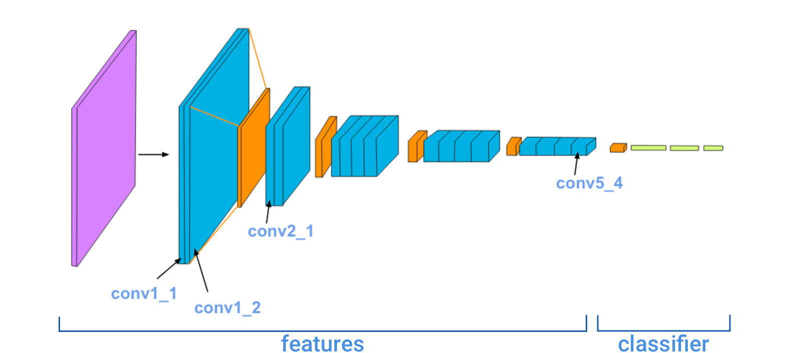
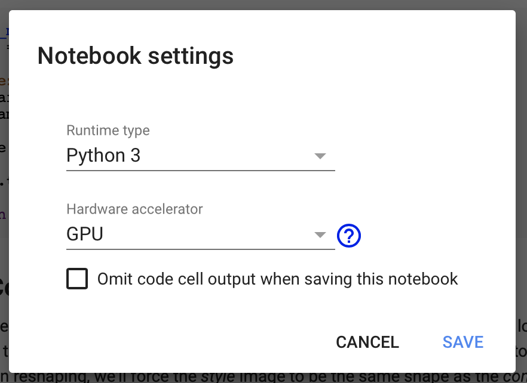

# Style Transfer in PyTorch

*This repository is based on the Lesson 6 of the Udacity MOOC **Deep Learning with PyTorch**.*

This notebook was was based on the *Style Transfer* method developed by the paper [Image Style Transfer Using Convolutional Neural Networks](https://www.cv-foundation.org/openaccess/content_cvpr_2016/papers/Gatys_Image_Style_Transfer_CVPR_2016_paper.pdf), with the PyTorch framework. 

In this paper it's proposed the style transfer method, which uses features extracted by a 19-layer pre-trained [VGG-network](https://arxiv.org/pdf/1409.1556.pdf). In the image below, the convolutional layers of the network are named by stack and the order inside each stack, i.e., *conv1_2* means a convolutional layer on the *first stack* and the *second position*. The deepest layer on this network will be *conv5_4*. 



The pre-trained network will come from the models on the [Torchvision model-zoo](https://pytorch.org/docs/stable/torchvision/models.html), and to download them you just need this code: 

```python
from torchvision import models

models.vgg19(pretrained=True).features
```

As seen on the picture above, this network is splitted into two major parts: the **features** and the **classifier**. The *features* will contain the feature extractor - the convolutional stacks together with pooling layers - and the *classifier* will have only the fully-connected layers and the *softmax* layer to train the network to perform some classification. As we are going to use the **VGG19** only for extracting features from the *content*, *style* and *target* images (and therefore **no** classifications tasks), we won't need the latter part of this network. 

The resulting image (*target*) should contain the desired components: objects and their arrangements should be similar to that of the **content image**, and style, colors and textures are similar to that of the **style image**. This is done comparing the output of a few convolution layers, which are described by the paper. 

## Example Image

As an example of the results of this notebook, it's shown on the image below the style transfer from the painting **Colors of Brazil** by [Romero Britto](https://en.wikipedia.org/wiki/Romero_Britto) as *style* image to the image of [Pico da Ibituruna](https://pt.wikipedia.org/wiki/Pico_do_Ibituruna), the *content* image, a mountain that is part of the landscape of Governador Valadares, city on the state of Minas Gerais.


On the `style-transfer.ipynb` notebook, it's presented this method, step by step, developed usign the PyTorch framework.

## Google Colaboratory

Since this solution requires multiple steps over the forward pass of a 19-layer convolutional neural network, it's recommended that this task should be done using a GPU. To that matter, it's easier to use the [Google Colaboratory](https://colab.research.google.com/notebooks/welcome.ipynb#recent=true), which is a platform made available by Google, that provides as far as 12 hours of GPU support (this GPU have CUDA support, required to run on PyTorch). The duration of this solution is based on the number of steps chosen, but with the suggested 5,000 steps it should not take longer than 15 minutes. 

The notebook `style-transfer.ipynb` is prepared to be ran on the Colaboratory environment, and the first cells are due to the setup of this environment, installing the required libraries and cloning this repository - for the style pictures suggested -. 

It's important to remember that before you run anything on Google Colab, you should make sure that the runtime type is *Python 3* and the hardware accelerator *GPU* (as shown on the image below), to get to this window you should press *Runtime* -> *Change Runtime Type*. 



After configurating the Runtime Options of your notebook you are good to go! Other thing to be remembered is to keep the model and the *target* image (since its pixels will be updated through *training*) always on the `cuda` (something that the code on the notebook already takes care of).

To try this code with your own images, just download the notebook, run it on Google Colab and import your own images also on Colab! 

Enjoy Google's free GPU! :-)